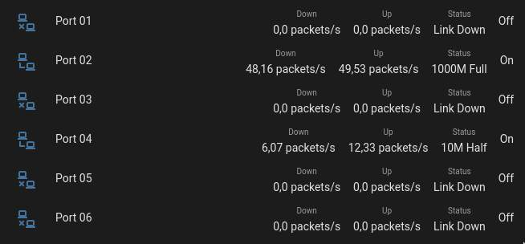

# TP-Link Easy Smart Switch integration for Home Assistant

This a _custom component_ for [Home Assistant](https://www.home-assistant.io/).
The `tplink_easysmartswitch` integration allows you to get port information from [TP-Link Easy Smart Switch](https://www.tp-link.com/fr/business-networking/easy-smart-switch/).

You will get two sensors by input enabled with all attributes availables.

## Installation

Copy the `custom_components/tplink_easysmartswitch` folder into the config folder.

## Configuration

Go to Configuration >> Integrations in the UI, click the button with + sign and from the list of integrations select TP-Link Easy Smart Switch.

## Lovelace Card example

With `multiple-entity-row` custom card:

```yaml
entities:
  - entities:
      - entity: sensor.port_01_ingress
        name: Down
      - entity: sensor.port_01_egress
        name: Up
      - attribute: link_status
        name: Status
    entity: binary_sensor.port_01
    type: custom:multiple-entity-row
type: entities

```



## Credits

https://github.com/psmode/essstat
